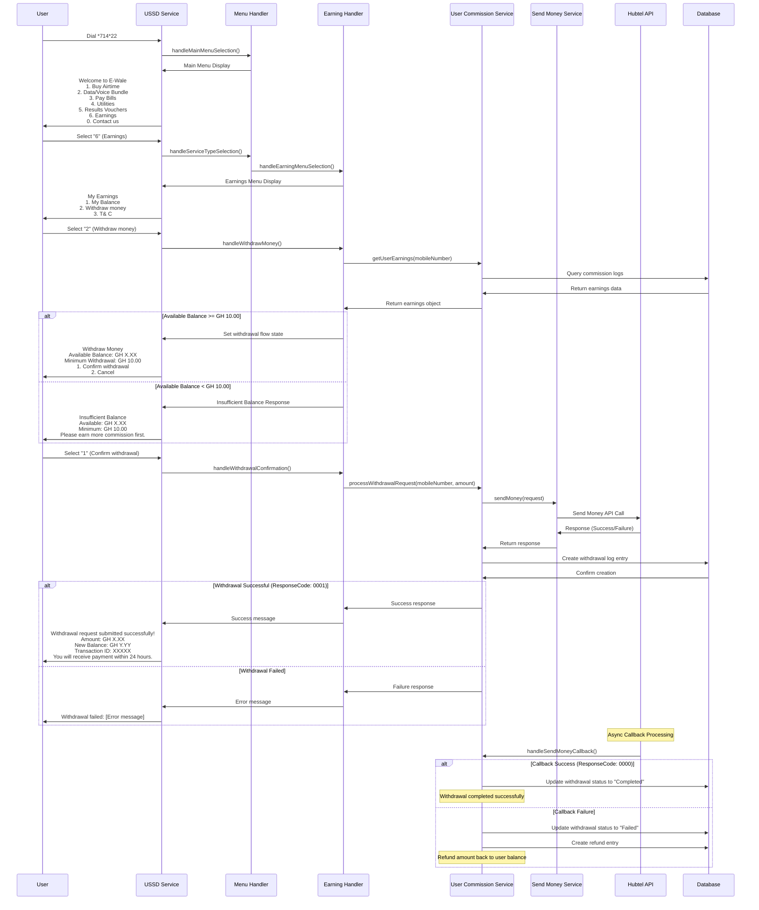

# Earning Withdrawal Flow - USSD Interaction Flow

## Overview
This document outlines the complete interaction flow for withdrawal requests under the earning flow in the E-Wale USSD service.

## Flow Diagram

## Detailed Step-by-Step Flow

### Step 1: USSD Initiation
- User dials `*714*22#`
- USSD service creates new session
- Main menu is displayed

### Step 2: Service Selection
- User selects option "6" for Earnings
- Menu handler routes to earning handler
- Earnings submenu is displayed

### Step 3: Earning Menu Selection
- User selects option "2" for "Withdraw money"
- System checks user's available balance
- If balance >= GH 10.00: Show withdrawal confirmation
- If balance < GH 10.00: Show insufficient balance message

### Step 4: Withdrawal Confirmation
- User selects "1" to confirm withdrawal
- System processes withdrawal request
- Creates withdrawal log entry in database
- Calls Hubtel Send Money API

### Step 5: Payment Processing
- Hubtel API processes the payment
- Returns immediate response (Success/Failure)
- User receives confirmation message

### Step 6: Async Callback Processing
- Hubtel sends callback when payment is processed
- System updates withdrawal status
- If failed: Creates refund entry to restore user balance

## Key Components

### 1. EarningHandler (`src/services/handlers/earning.handler.ts`)
- Handles earning menu selections
- Manages withdrawal flow state
- Processes withdrawal confirmations

### 2. UserCommissionService (`src/services/user-commission.service.ts`)
- Manages user earnings calculation
- Processes withdrawal requests
- Handles Hubtel API integration
- Manages withdrawal callbacks and refunds

### 3. SendMoneyService (`src/services/send-money.service.ts`)
- Handles Hubtel Send Money API calls
- Formats phone numbers and determines channels
- Manages API request/response handling

### 4. Session Management
- Tracks withdrawal flow state
- Stores user earnings data
- Manages session lifecycle

## Database Schema

### CommissionTransactionLog
- Stores withdrawal transactions
- Tracks commission earnings
- Manages withdrawal status
- Handles refund entries

### Key Fields:
- `mobileNumber`: User's mobile number
- `amount`: Withdrawal amount
- `commission`: Negative amount for withdrawals
- `status`: Transaction status (Pending, Completed, Failed)
- `hubtelTransactionId`: Hubtel transaction reference
- `clientReference`: Unique withdrawal reference

## Error Handling

### Insufficient Balance
- Minimum withdrawal: GH 10.00
- Shows available balance and minimum requirement
- Encourages user to earn more commission

### API Failures
- Handles Hubtel API errors
- Creates failed withdrawal entries
- Provides user-friendly error messages

### Callback Failures
- Automatically refunds failed withdrawals
- Updates transaction status
- Restores user balance

## Security Considerations

### Validation
- Validates minimum withdrawal amount
- Checks available balance
- Prevents duplicate withdrawals

### Transaction Tracking
- Unique client references
- Comprehensive logging
- Audit trail for all transactions

## Business Rules

### Withdrawal Limits
- Minimum: GH 10.00
- Maximum: Available balance
- Processing time: Within 24 hours

### Commission Calculation
- Based on service transactions
- Real-time balance updates
- Automatic refunds for failures

## Integration Points

### Hubtel Send Money API
- Endpoint: Hubtel Send Money service
- Authentication: API credentials
- Callback: Webhook for status updates

### Database
- MongoDB collections
- Real-time updates
- Transaction logging

## Monitoring and Logging

### Transaction Logs
- All withdrawal attempts logged
- Status tracking
- Error monitoring

### Performance Metrics
- Success rates
- Processing times
- User satisfaction

## Future Enhancements

### Planned Features
- Withdrawal history
- Multiple payment methods
- Scheduled withdrawals
- Enhanced notifications

### Scalability
- Queue-based processing
- Batch operations
- Performance optimization
